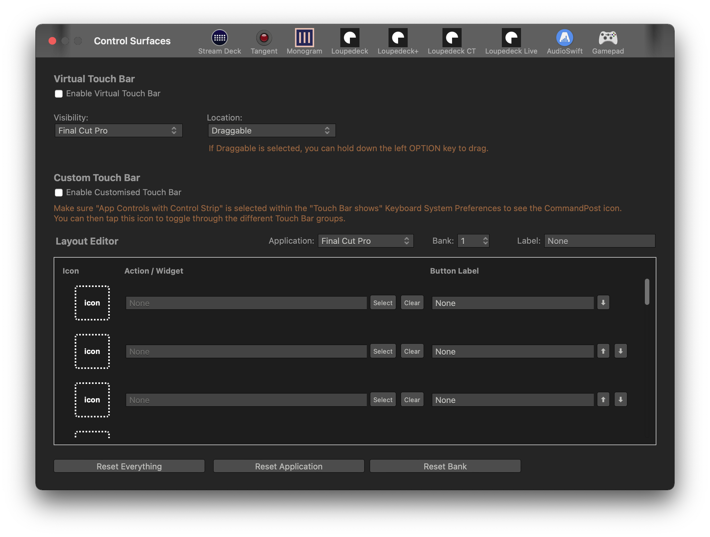
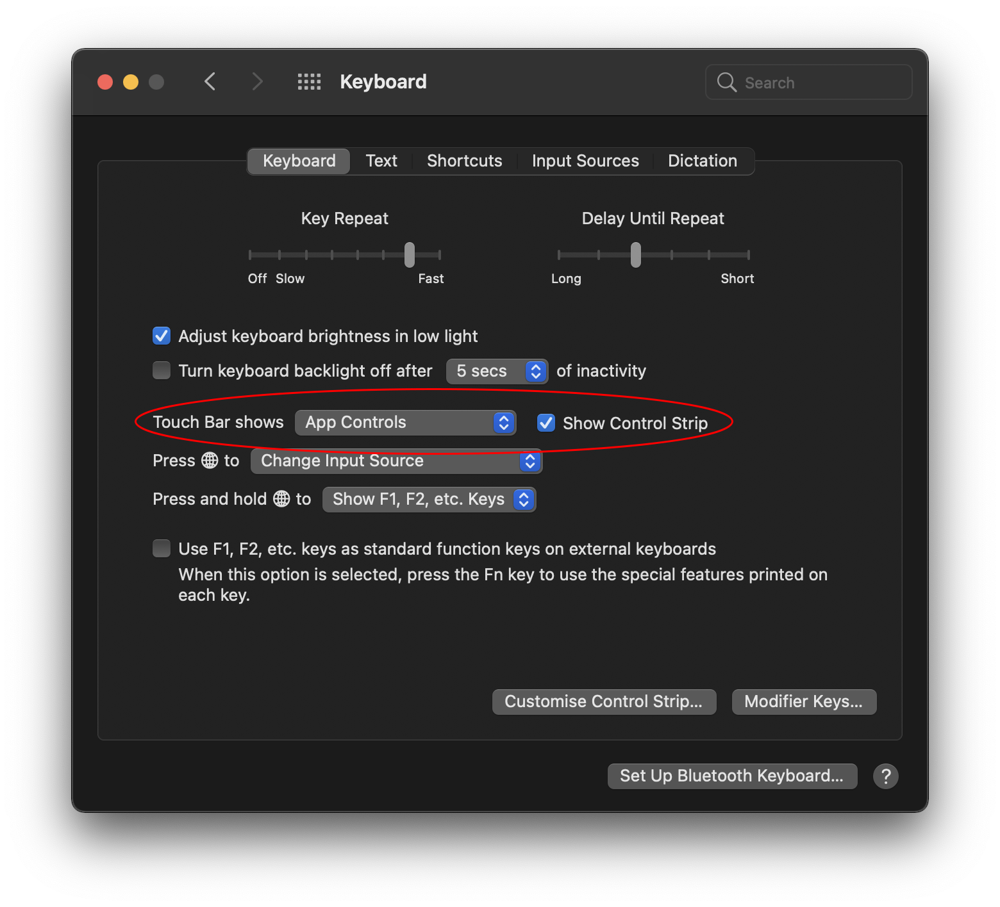
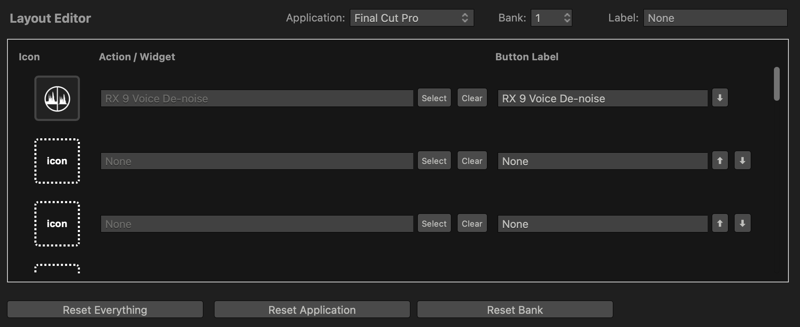
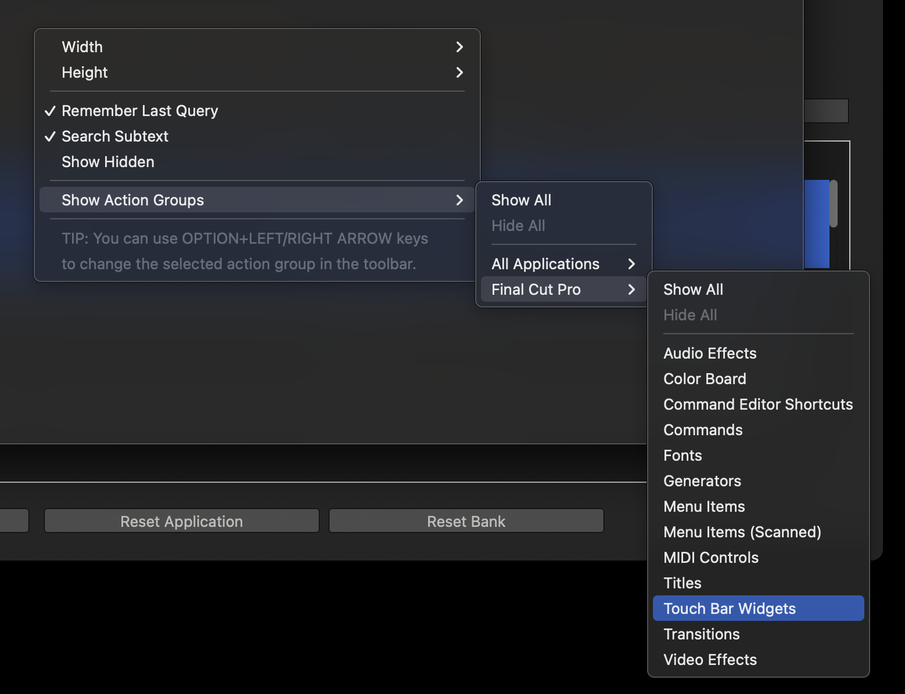

# Touch Bar
---

If you're running **macOS Sierra 10.12.1** or above, you can make use of CommandPost's awesome Touch Bar features.

There's both a **Virtual Touch Bar**, which displays a Touch Bar on your computer screen, and the ability to add custom items to both the virtual and physical Touch Bar.

You can enable both options by going to the **Touch Bar** preferences panel, via clicking the **Control Surfaces**, then **Touch Bar** option towards the bottom of the CommandPost menubar.

It looks like this:

---

## Virtual Touch Bar
---

The **Virtual Touch Bar** is fairly straight forward - it draws a Touch Bar on your Mac's screen, and you can use your mouse to control it.

Once enabled via the Preferences, you have two other options:

* **Visibility:** allows you to either only have the Virtual Touch Bar showing when Final Cut Pro is active, or have it active the entire time.
* **Location:** Allows you to make it draggable (by holding down the OPTION key and dragging with your mouse), stick to the Top Centre of the Timeline, or the Centre of the Mouse location (when it's first shown).

You can toggle the Virtual Touch Bar via shortcut keys (the default shortcut key is **CONTROL + OPTION + COMMAND + Z** within Final Cut Pro), or assign it to a HUD, Touch Bar or Stream Deck button.

---

## Custom Touch Bar

The custom Touch Bar is incredibly powerful and versatile - it allows you to assign ANY action in CommandPost to a custom Touch Bar button.

The first thing you need to do to take use of this functionality is make sure that **App Controls** is selected and **Control Strip** is checked within the **Touch Bar shows** macOS System Preferences Keyboard panel, as shown here:

What this does is enable the CommandPost icon to appear in the Control Strip, allowing you to enable our custom shortcuts.

Once this is enabled, and **Enable Customised Touch Bar** is ticked, you can then assign Icons, Actions and Labels to buttons within the Preferences Panel, for example:

Much like [keyboard shortcuts](interface/shortcuts/README.md), there's both a Global Touch Bar, and application specific Touch Bars - currently limited to Final Cut Pro. You can Customize both Touch Bar sepearately by selecting the corresponding option on the Application dropdown menu. There is also nine Banks of setting available for both Touch Bar, so you can quickly switch between configuration.

You can switch Touch Bar Banks via shortcut keys, Search Console, or assign the toggle to a HUD or any control surfaces.

Pressing the **Select** button for each column, will pop up a [Console](interface/console/README.md) allowing you to easily search for "actions". If you right click on the Console, you can also define what **Sections** you want to view, for example:

There's also the option to **Favourite** or **Hide** items in the Console, and change your search options.

In the above screenshot, we've just enabled **Touch Bar Widgets**, which are actually a bit more special than normal buttons. With widgets, the icon and label columns in the Preferences are ignored, and you're given a custom interface.

For example, the **Color Board (Grouped)** widget looks like this:

This widget allows you to control Final Cut Pro's Color Board using your fingers, which is pretty awesome.

If you don't have a physical Touch Bar, you can also use [Duet](https://www.duetdisplay.com) to view the Color Board Widget on your iPad.

At the bottom of the Touch Bar Preferences screen there's an option to **Reset All Touch Bar Items** which will set all the Touch Bar Items to None. There's also a **Reset Application** option and a **Reset Bank** option that reset only the currently selected Application or Bank repsectively.

You can toggle the Custom Touch Bar via shortcut keys, Search Console, or assign the toggle to a HUD or any control surfaces.