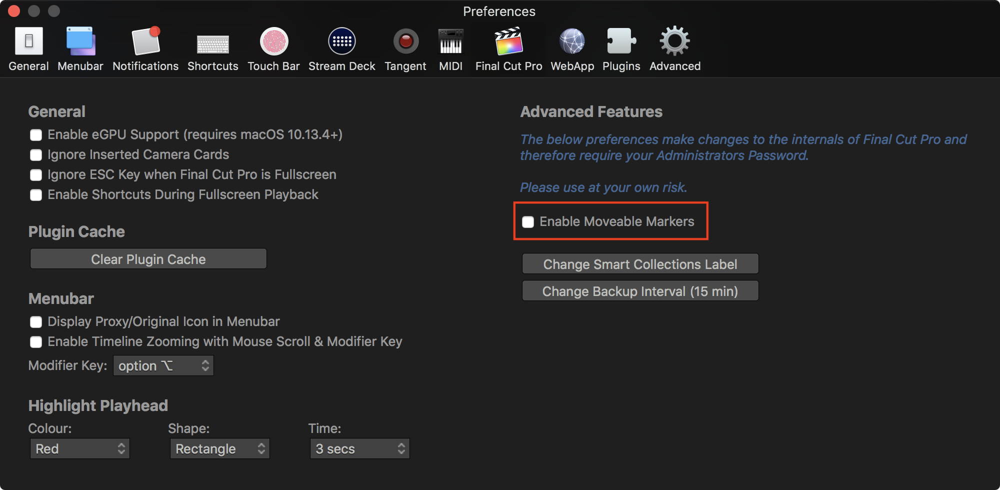

# Moveable Markers
---

**Default Shortcut: CONTROL+OPTION+COMMAND+Y**

This feature turns on a hidden Final Cut Pro preference originally discovered by [Alex4D](http://alex4d.com/notes/item/fcpx-movable-markers) that allows you to move markers in your timeline with your mouse.

You can activate this feature via the Final Cut Pro section of the CommandPost Preferences:

As this feature require Administrator Privileges to activate, you must restart Final Cut Pro before the changes take affect.