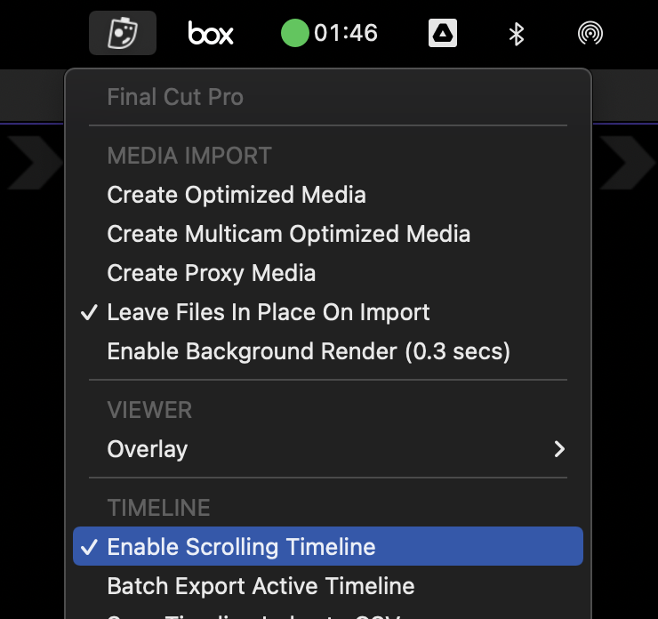

# Scrolling Timeline
---

**Default Shortcut: CONTROL+OPTION+COMMAND+W**

As its been the number one request on [Richard Taylor’s Final Cut Pro X Top Requests Master List](http://fcpx.tv/top.html) since day one, we’ve finally added a Scrolling Timeline option to Final Cut Pro.

To activate and deactivate Scrolling Timeline Mode, by default you press **CONTROL+OPTION+COMMAND+W**, or select "Enable Scrolling Timeline" from the CommandPost menu.

Once activated, you will see a little notification on your screen saying “Scrolling Timeline Activated”.

Now, if you have your mouse in the timeline area and press spacebar, the timeline will automatically scroll for you! However, if you press spacebar with the mouse outside of the timeline area – the timeline will playback as normal, allowing you to easily switch between the two modes.

You can also deactivate the scrolling timeline during playback by pressing the Scrolling Timeline Mode shortcut key again (**CONTROL+OPTION+COMMAND+W**).

Of course, this shortcut key can always be customised and changed via the Shortcut Preferences panel.

If your playhead is not visible when you press play, CommandPost will automatically move your playhead to the middle of the timeline.

You can continue to use all your usual shortcuts (i.e. ‘Add Marker’ and ‘Blade’) whilst playing back and the playhead will remain static.