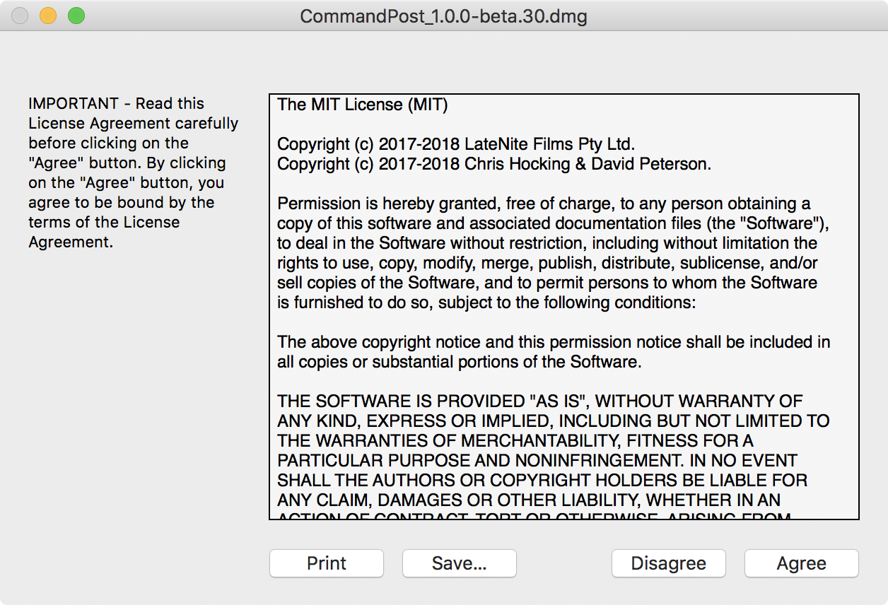
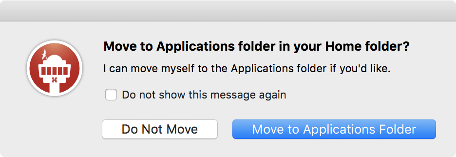
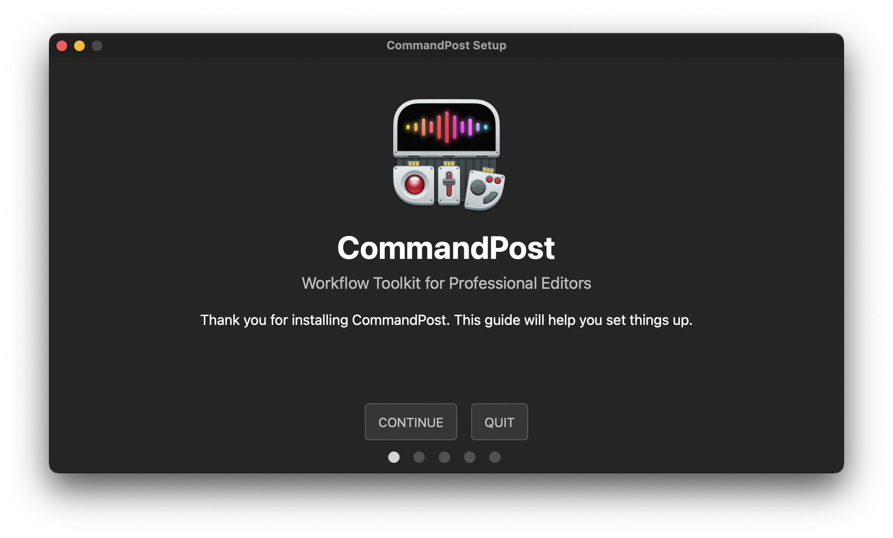
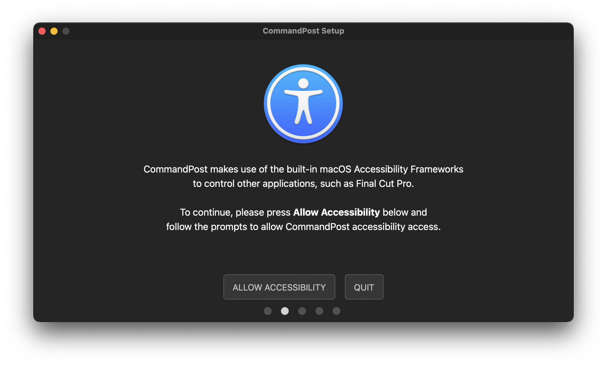
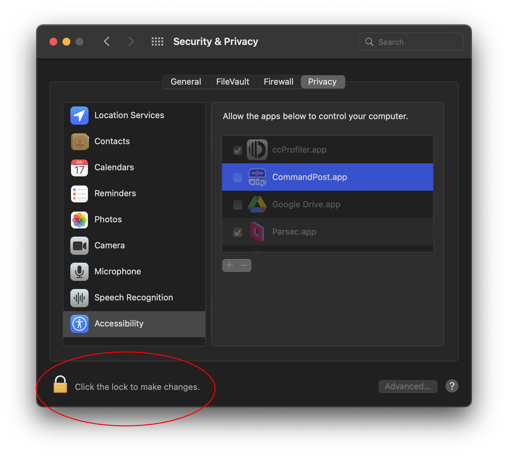
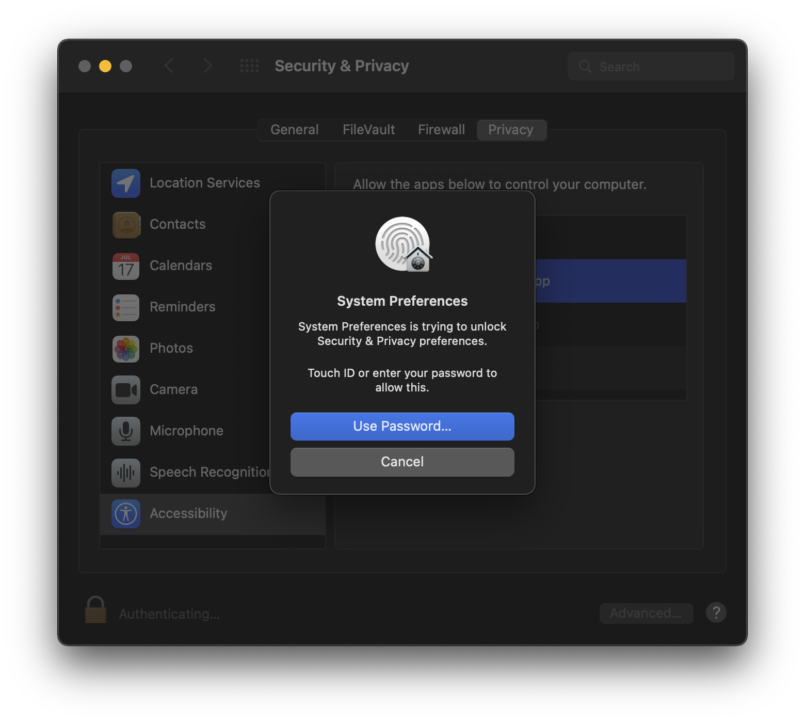
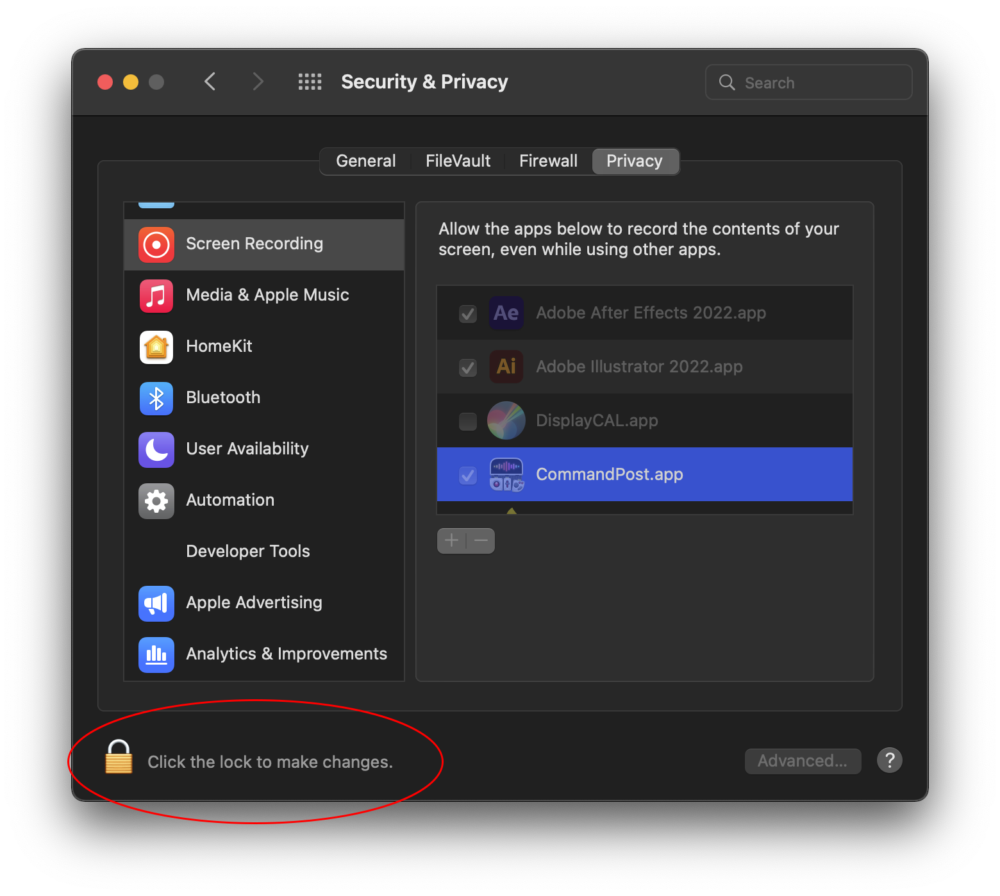
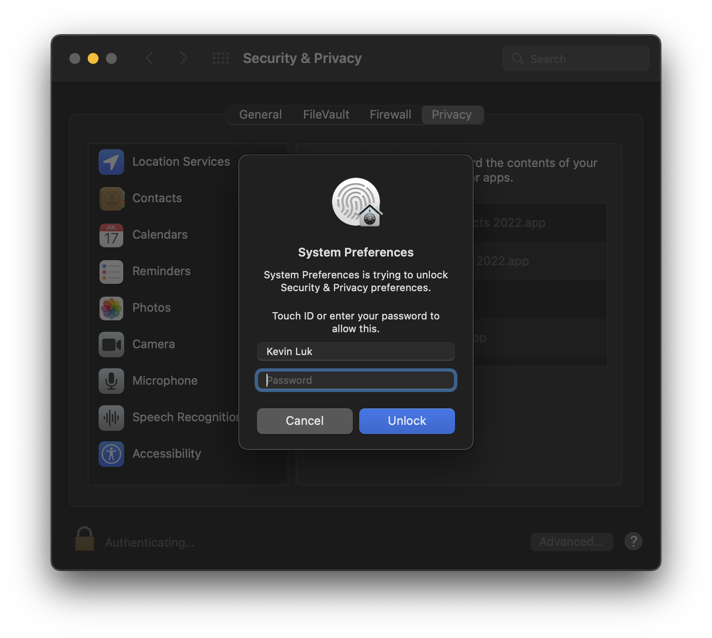

# Installing CommandPost
---

You can download the latest release of CommandPost as an DMG package [here](http://commandpost.io).

Once downloaded, simply open the package by double-clicking it.

You will be presented with a MIT license agreement like the below - click **Agree** if you accept.

The DMG package will open, looking like this:

Double click the CommandPost icon. It will now ask you if you wish to move CommandPost to your Applications folder:

Click **Move To Applications**. CommandPost will now launch the Welcome Screen:

Click **CONTINUE**.

You'll then be presented with the Accessibility Permissions screen:

When you click **ENABLE ACCESSIBILITY**, macOS will present you with this:

Click **Open System Preferences**.

When the **Privacy** Tab of the **Security & Privacy** System Preferences opens, you'll see CommandPost in the "Allow the apps below to control your computer" list. However the panel is locked, so you need to click the paddock icon in the bottom left corner of the screen to make changes.

Enter your computers password and press **Unlock**:

Once the preferences are unlocked, you can tick CommandPost in the list. As soon as you click it, System Preferences will close, and you'll go back to the CommandPost setup:

When you click **START SCAN** CommandPost will begin scanning your system for Final Cut Pro Plugins & Motion Templates. This process can take several minutes to complete.

Once the scanning is complete you'll be presented with:

Click **CLOSE**, and you're ready to use CommandPost!

You can access CommandPost's features via it's [menubar icon](http://help.commandpost.io/interface/menubar).