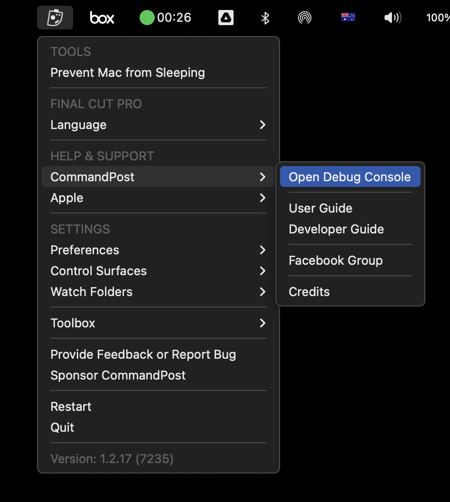
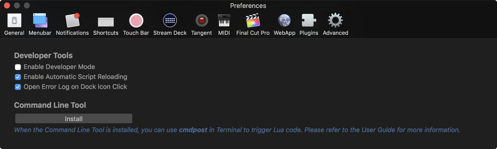
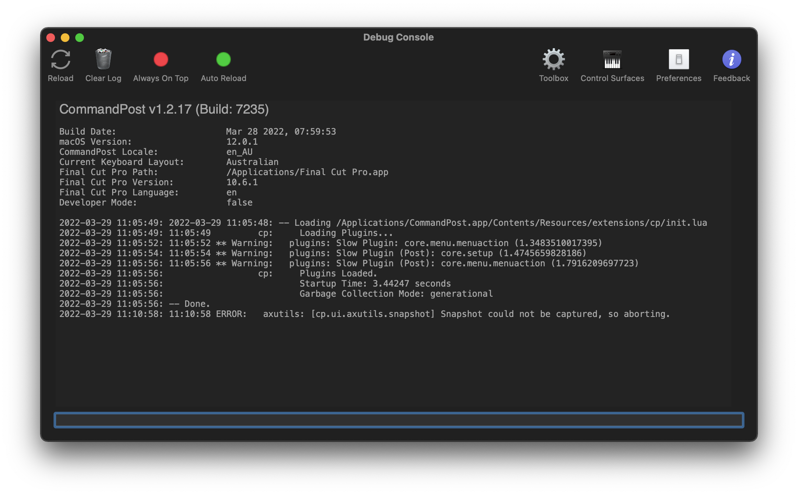
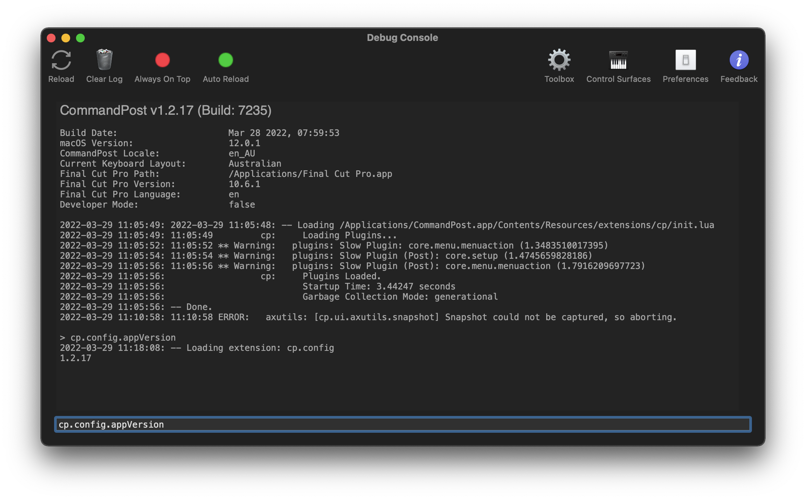

# Error Log
---

Because CommandPost is powered by a huge collection of Lua scripts, the Error Log is one of the most important places in CommandPost to track down bugs and issues.

You can access the Error Log via the "Help & Support > CommandPost" section of the menubar:

There is also an option to "Open Error Log on Dock Icon Click", which is 'on' by default:

Similar to `Console.app` in macOS, the Error Log basically displays all of CommandPost's log files for the current session:

In the menu bar, you can:

- Force CommandPost to reload it's Lua scripts
- Clear the Error Log
- Toggle whether or not the Error Log should always be on top of other macOS windows
- Automatically reload CommandPost when a Lua file is modified externally (i.e. if you modify a file in a text editor with CommandPost running)
- Open the Preferences panel
- Submit Feedback to the CommandPost Developers

The text box at the bottom of the Error Log allows you to execute Lua Commands directly. This is really useful when developing CommandPost plugins. For example:

You can learn more about developing for CommandPost in the [Developers Guide](https://dev.commandpost.io).