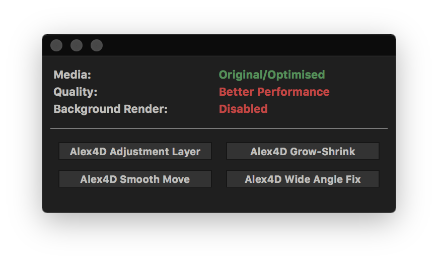
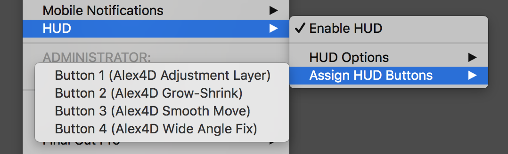
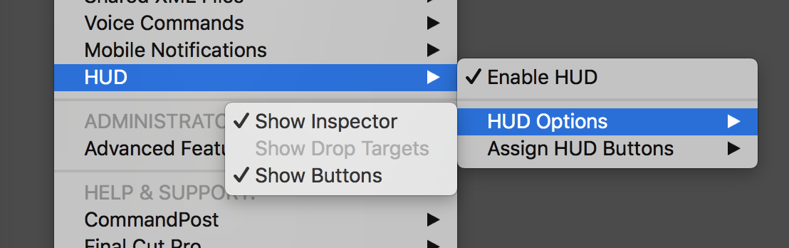
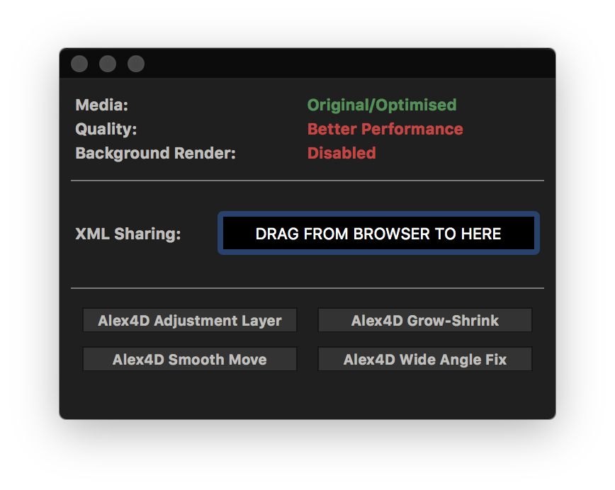

# HUD
---

The HUD stands for "Heads Up Display" and allows you to display a bunch of additional information and buttons with Final Cut Pro, for example:

You can assign actions to the HUD buttons via the menubar:

You can also choose what "sections" of the HUD you want to view via the menubar:

The **Show Drop Targets** will only be enabled if **Shared XML Files** is enabled in the menubar.

