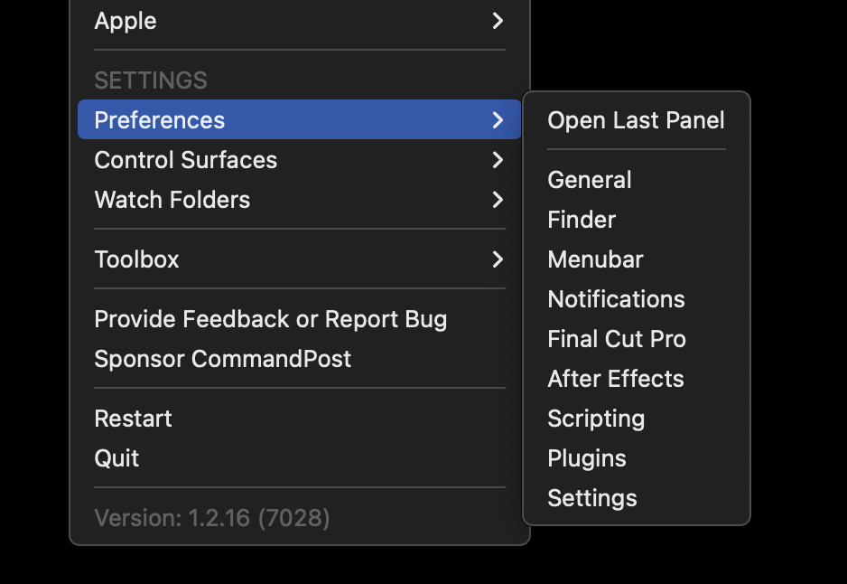
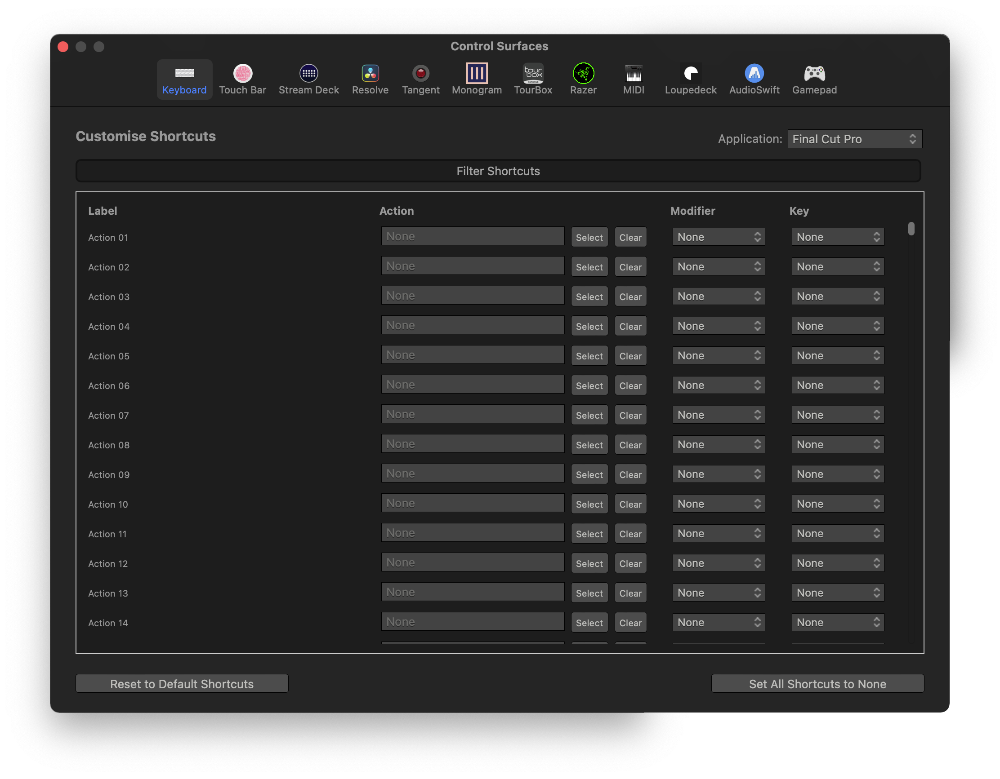
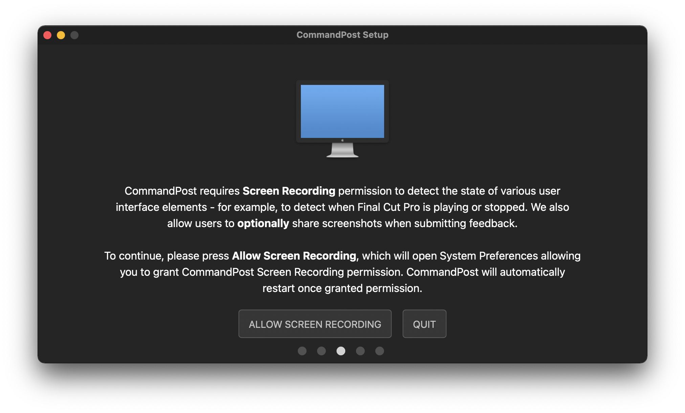

# Shortcuts
---

The most common way of triggering actions in CommandPost is via shortcut keys on your keyboard.

There are two types of shortcuts keys - Global shortcuts, and application specific shortcuts (currently limited to Final Cut Pro).

Global shortcuts work anytime Final Cut Pro isn't active, and Final Cut Pro shortcuts only work when Final Cut Pro is active.

When you first install CommandPost, there are a few built-in shortcuts predefined, for example, the following Global shortcuts are enabled by default:

- **CONTROL + OPTION + COMMAND + SPACE:** Activate Global Console
- **CONTROL + OPTION + COMMAND + L:** Launch Final Cut Pro

There are also built-in shortcuts predefined for Final Cut Pro.

You can customise the shortcuts keys in the **Shortcuts** Preferences panel - which can be accessed by pressing the **Preferences...** option near the bottom of the CommandPost menubar:

This is what the Shortcut Preferences panel looks like:

The top drop-down allows you to select between Global Shortcuts or application specific shortcuts (currently limited to Final Cut Pro).

The left column (Label), contains all of the Actions available as shortcuts for the selected group, which can be assigned to a modifier and key. A shortcut requires BOTH a modifier and a key to become active.

There is also a **Reset to Default Shortcuts** button, which resets all the shortcuts to how they appeared when CommandPost was first installed, and a **Set All Shortcuts to None**, which sets all shortcuts to None.

---

**PLEASE NOTE:** The setup screen described below has been removed in Beta 22 and later. However, you can still enable "Control CommandPost Shortcuts within Final Cut Pro" via the Final Cut Pro Preferences window.

When you first install CommandPost you'll be presented with the following setup screen:

This setup screen asks you whether you wish to use Final Cut Pro's Command Editor to control it's shortcuts, or the built-in CommandPost Shortcut Manager, as explained above.

If you select **USE FINAL CUT PRO**, you'll be asked for your Administrator password. Once done, CommandPost will add all it's own shortcuts (for example, "Enable Scrolling Timeline") to Final Cut Pro's own Command Editor for easy access.

If you select **USE COMMANDPOST**, then you can setup your CommandPost Final Cut Pro shortcuts via the Shortcuts tab in CommandPost's Preferences.

---

This option can be changed with the **Final Cut Pro** CommandPost Preferences:

This is how they appear in the Command Editor:

