# Syncing Final Cut Pro with Logic
---

## Requirements

* [CommandPost Beta 22 or later](http://commandpost.io)
* [Final Cut Pro 10.4 or later](https://www.apple.com/au/final-cut-pro/)
* [Logic 10.4 or later](https://www.apple.com/au/logic-pro/)
* [MidiPipe 1.4.6](http://www.subtlesoft.square7.net)

---

## Introduction

It's currently possible to synchronise Final Cut Pro and Logic Pro using MIDI Machine Control within CommandPost.

MIDI Machine Control, or MMC as it's commonly referred to, is a subset of the MIDI specification and provides specific commands for controlling recording equipment such as multi-track recorders.

MMC messages can be sent along a standard MIDI cable for remote control of such functions as Play, Fast Forward, Rewind, Stop, Pause, and Record.

These are "System Exclusive" (SysEx) messages, specifically Real Time Universal SysEx messages.

The way we currently sync Final Cut Pro and Logic currently is fairly basic and not "true" synchronisation.

For example, if you set CommandPost to "Listen to MMC Input", when you send CommandPost a "Play" command, Final Cut Pro will start playing. CommandPost supports the GOTO, PLAY and STOP commands.

If you set CommandPost to "Transmit MMC", the opposite will occur. If you press "Play" in Final Cut Pro, it will send a MMC message to whatever device you specify, causing any external MIDI devices to "Play". Before it sends the play signal it sends the current timecode value.

---

## Why not MIDI Time Code (MTC)?

To give you some geeky backstory first, MIDI time code (MTC) embeds the same timing information as standard SMPTE timecode as a series of small 'quarter-frame' MIDI messages.

There is no provision for the user bits in the standard MIDI time code messages, and SysEx messages are used to carry this information instead.

The quarter-frame messages are transmitted in a sequence of eight messages, thus a complete timecode value is specified every two frames.

If the MIDI data stream is running close to capacity, the MTC data may arrive a little behind schedule which has the effect of introducing a small amount of jitter. In order to avoid this it is ideal to use a completely separate MIDI port for MTC data.

Larger full-frame messages, which encapsulate a frame worth of timecode in a single message, are used to locate to a time while timecode is not running.

Unlike standard SMPTE timecode, MIDI timecode's quarter-frame and full-frame messages carry a two-bit flag value that identifies the rate of the timecode, specifying it as either:

* 24 frame/s (standard rate for film work)
* 25 frame/s (standard rate for PAL video)
* 29.97 frame/s (drop-frame timecode for NTSC video)
* 30 frame/s (non-drop timecode for NTSC video)

MTC distinguishes between film speed and video speed only by the rate at which timecode advances, not by the information contained in the timecode messages; thus, 29.97 frame/s dropframe is represented as 30 frame/s dropframe at 0.1% pulldown.

MTC allows the synchronisation of a sequencer or DAW with other devices that can synchronise to MTC or for these devices to 'slave' to a tape machine that is striped with SMPTE. For this to happen a SMPTE to MTC converter needs to be employed. It is possible for a tape machine to synchronise to an MTC signal (if converted to SMPTE), if the tape machine is able to 'slave' to incoming timecode via motor control, which is a rare feature.

Now, whilst all this sounds great, and in theory CommandPost can fully support MTC, the issue is, currently the only way we know how to control the playhead position in Final Cut Pro is by "clicking" the Viewer's timecode value and entering in a timecode value. This makes it impractical for controlling Final Cut Pro from an external device transmitting MTC.

Also, the only way we can "read" the current timecode from Final Cut Pro is by monitoring either the Viewer Timecode Display or the Playhead Timecode Value (using the Accessibility Framework), however, as of Final Cut Pro 10.4 it doesn't seem like the Timecode Viewer nor the playhead accurately "keeps up" with realtime playback.

Given these issues, even though we have check boxes for MTC in the CommandPost MIDI Preferences - and we are "watching" for these trigger in CommandPost behind the scenes, currently we haven't implemented any functionality for MTC & Final Cut Pro... yet.

However, if you are developing your own scripts with CommandPost you have full access to this incoming and outgoing MTC data.

---

## IAC Driver Workaround

There seems to be a [known bug](https://www.logicprohelp.com/forum/viewtopic.php?t=119814) with Apple's IAC Driver that means it doesn't correctly pass through MMC messages.

To get around this we use [MidiPipe 1.4.6](http://www.subtlesoft.square7.net).

---

Firstly, let's enable and rename the IAC Driver:

1. Open **Audio MIDI Setup.app** from Spotlight.

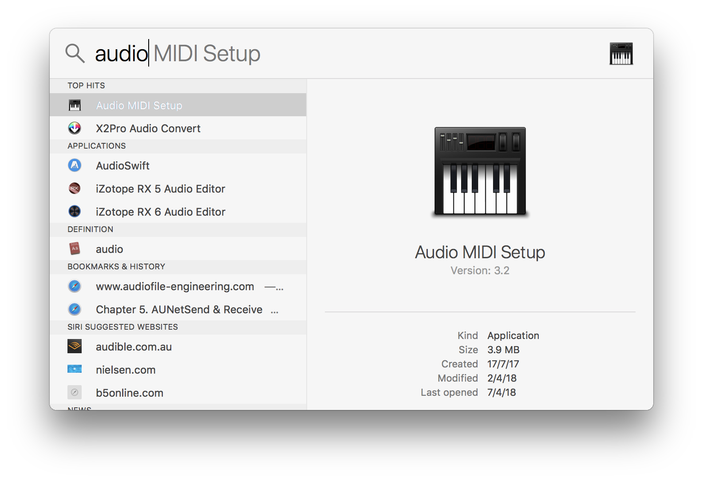

2. Press **CMD + 2** or goto "Window > MIDI Studio" to open the MIDI Studio.

3. Double click the IAC Driver icon.

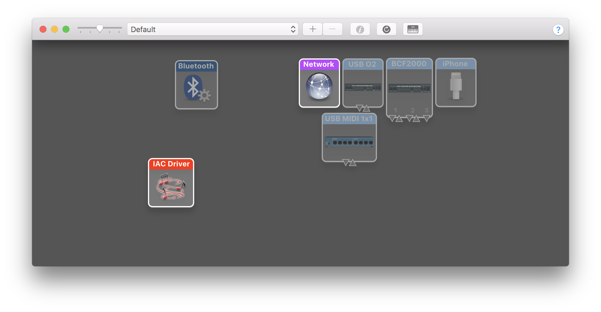

4. Make sure "Device is Online" is checked, and change the Device Name to **CommandPost** to make it easier to find later if needed.

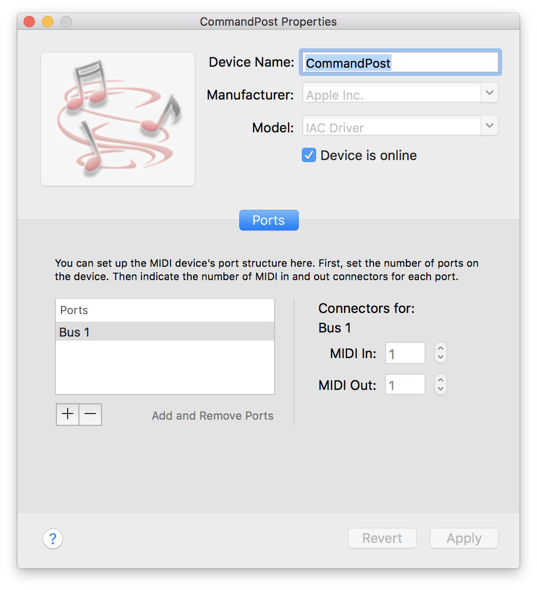

5. Close "Audio MIDI Setup".

---

Now we can setup MidiPipe.

1. Download [MidiPipe 1.4.6](http://www.subtlesoft.square7.net).

2. Open MidiPipe.

3. Create a new Pipe (let's call it "Pipe 1") that has the **MIDI Out** set to **MidiPipe Output 1**. Make sure **Pass Through** is selected.

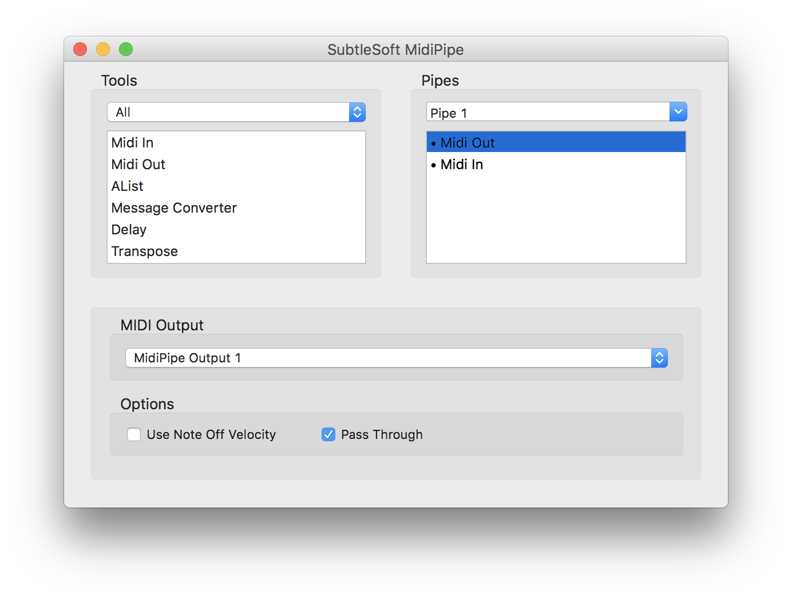

4. Set the **Midi In** to **MidiPipe Input 1**.

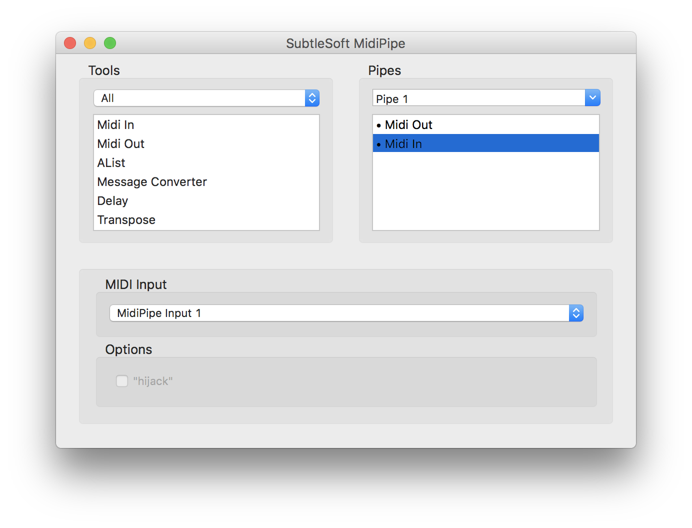

5. Create a new Pipe (let's call it "Pipe 2" that has the **Midi In** set to **MidiPipe Input 1**.

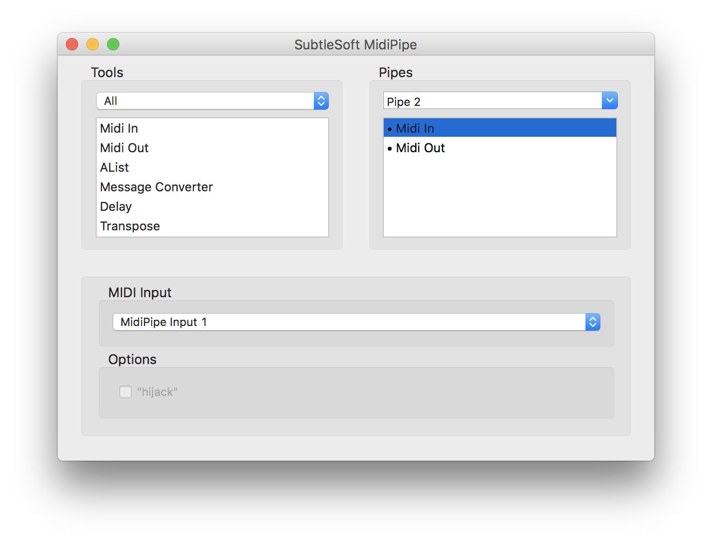

6. Set the **Midi Out** to **CommandPost - Bus 1** and make sure **Pass Through** is selected.

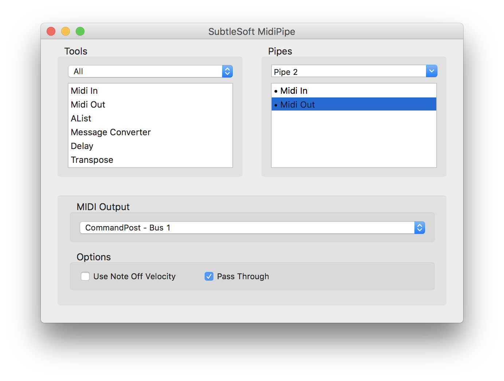

---

## Triggering Logic from Final Cut Pro

This section will explain how to trigger Logic from Final Cut Pro.

---

### Setting up CommandPost

1. Open the CommandPost Preferences via the **Preferences...** bottom near the bottom of the menu bar.

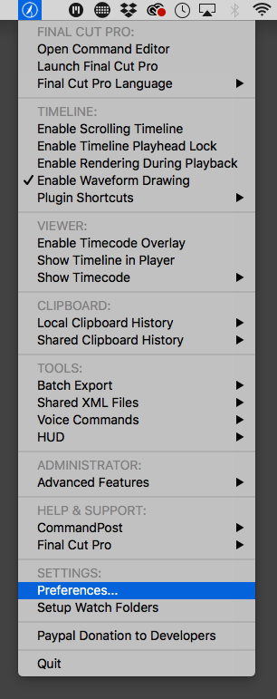

2. In the MIDI Tab, enable "Transmit MMC" and set the device to "Bus 1" (which is the Virtual MIDI Device for the IAC Driver).

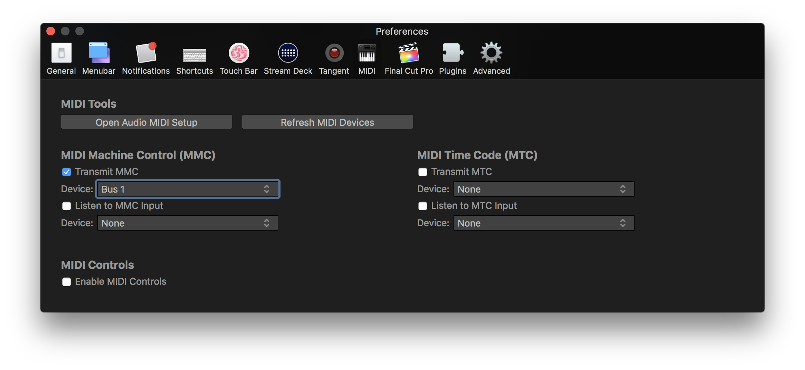

---

### Setting up Logic

1. Open up a new or existing Logic Pro project making sure your starting timecode matches what you have in Final Cut Pro.

2. Go to "File > Project Settings > Synchronisation..."  from the menu bar.

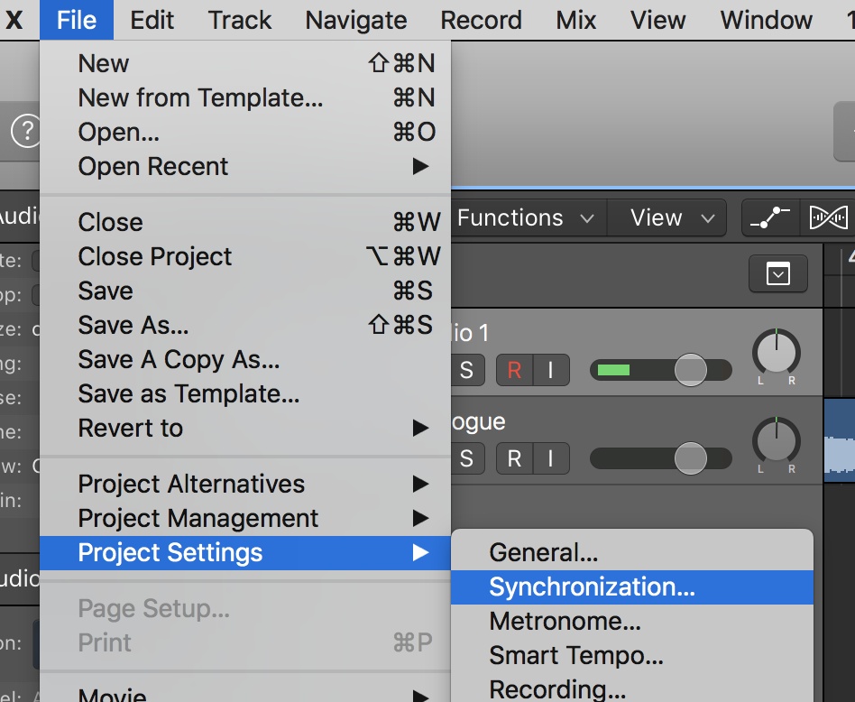

3. On the MIDI Tab, make sure **Listen to MMC Input** is ticked, then close this window.

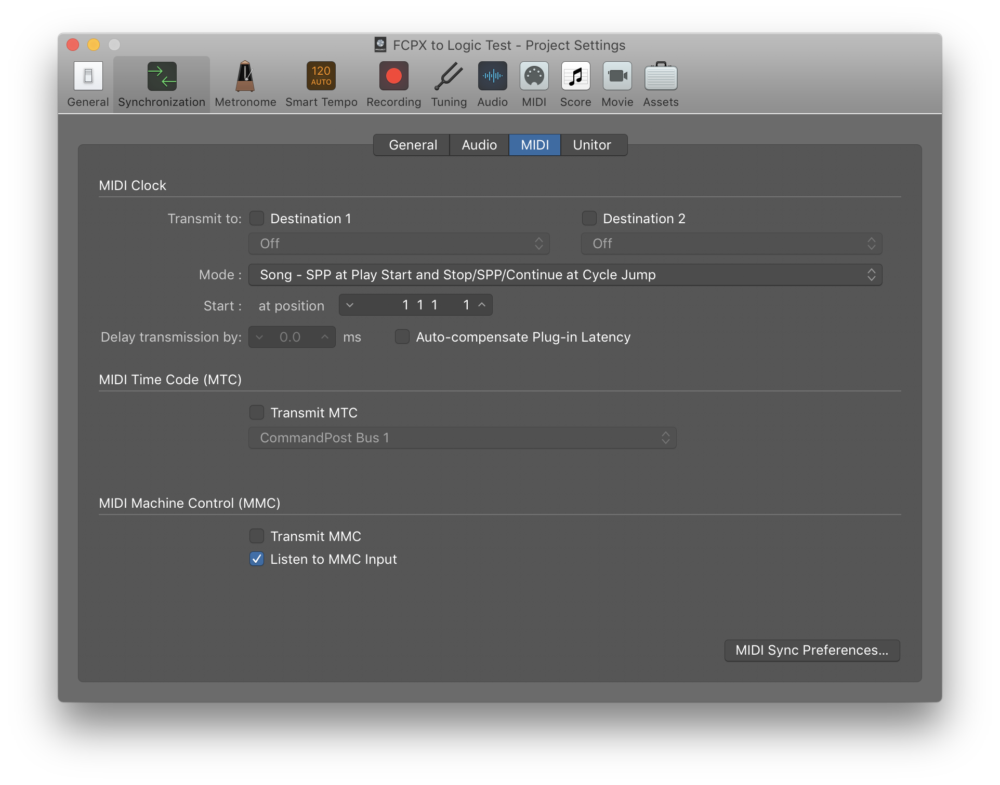

That's it! Now when you press play in Final Cut Pro, it will jump to the correct timecode in Logic and start playing.

---

## Triggering Final Cut Pro from Logic

This section will explain how to trigger Logic from Final Cut Pro.

---

### Setting up CommandPost

1. Open the CommandPost Preferences via the **Preferences...** bottom near the bottom of the menu bar.

2. In the MIDI Tab, enable "Listen to MMC Input" and set the device to "Bus 1" (which is the Virtual MIDI Device for the IAC Driver).

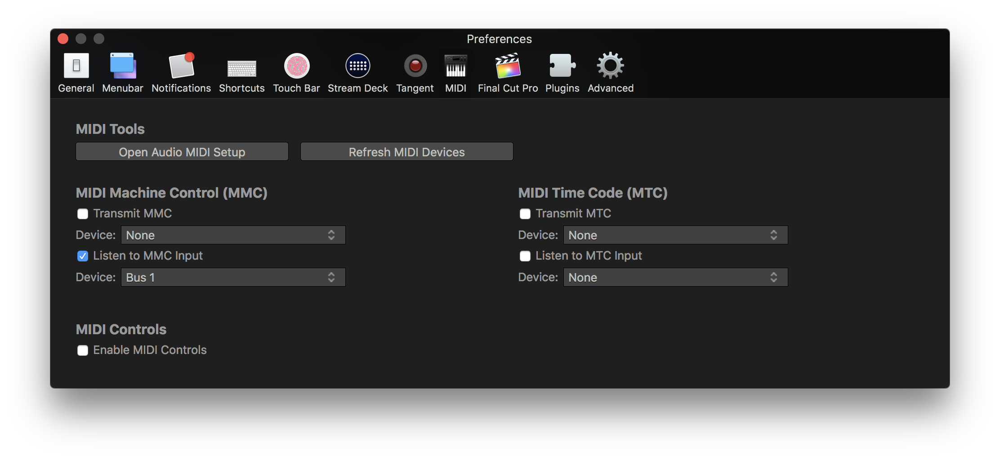

---

### Setting up Logic

1. Open up a new or existing Logic Pro project making sure your starting timecode matches what you have in Final Cut Pro.

2. Go to "File > Project Settings > Synchronisation..."  from the menu bar.

3. On the MIDI Tab, make sure **Transmit MMC** is ticked, then close this window.

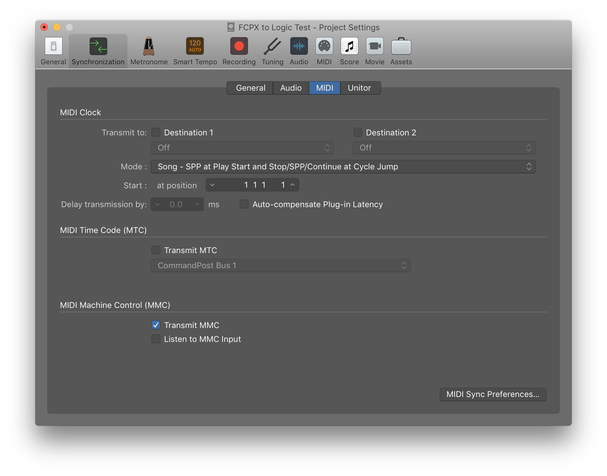

That's it! Now when you press play in Logic, Final Cut Pro will become active, jump to the correct timecode and start playing.