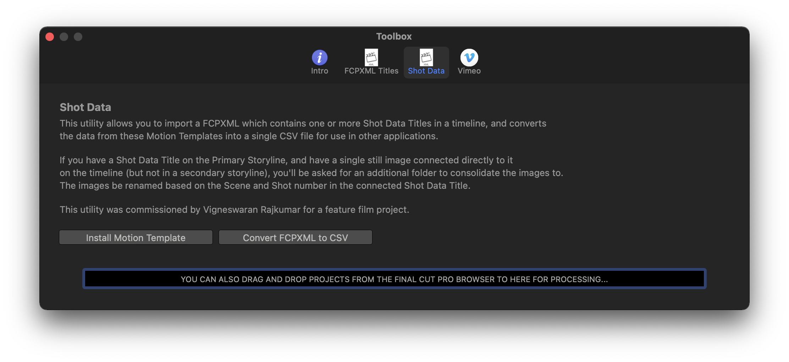

# Shot Data
---

This utility allows you to import a FCPXML which contains one or more Shot Data Titles in a timeline, and converts
the data from these Motion Templates into a single CSV file for use in other applications.

If you have a Shot Data Title on the Primary Storyline, and have a single still image connected directly to it
on the timeline (but not in a secondary storyline), you'll be asked for an additional folder to consolidate the images to.
The images be renamed based on the Scene and Shot number in the connected Shot Data Title.

This utility was commissioned by Vigneswaran Rajkumar for a feature film project.

More detailed documentation will eventually be written here.

